## **BikeTherapist**

BikeTherapist is a service booking progressive web app. Built to make booking services easily available without any hassle to
users and customers.  
Works on the idea of CRUD operations. Add new bookings updating users automatically about their booking status as per booking dates.

> ### Test(Admin) Credentials:
>
> Email: test@gmail.com  
> Password: Tarun987

## **Features**

- Book a service for the availabel products.
- Book across various product(bikes) variants.
- Choose the favourable time slot and few additional details.
- Pay for the booked time slot and recieve an invoice for your booking.
- Receive the booking status on the given email.
- Responsive Design and animations.

## **Landing Page**

- Install the our PWA on mobile by clicking on install button, for better and fast user experiences.
- Explore the services, variants, how the process is carried.
- Customer reviews and rating to the services we provide.

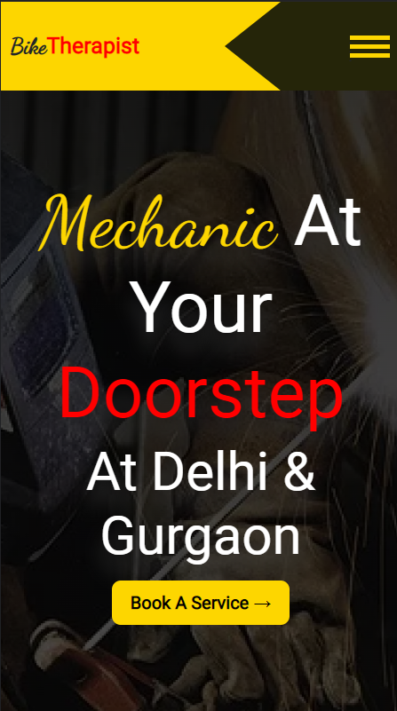

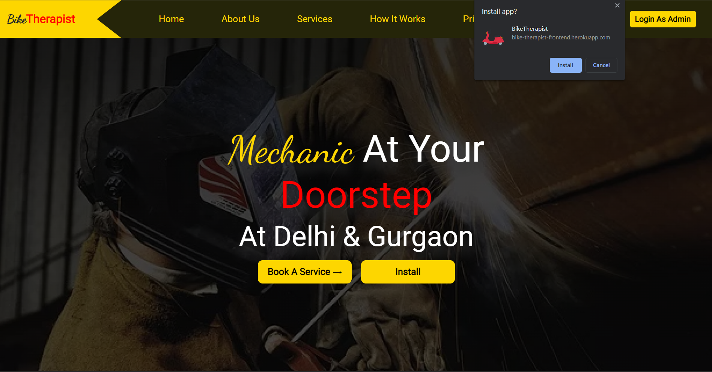

## **Admin Dashboard**

- The Admin dashboard has many various sorting
  features and status updating methods to keep the
  user updated about their bookings.
- Helps a super user to find & generate user invoices in case of customer supports.
- Handling the paymets, booking status, booking details etc.
- Additionaly describes the hike, growth, and profit status through graphs.

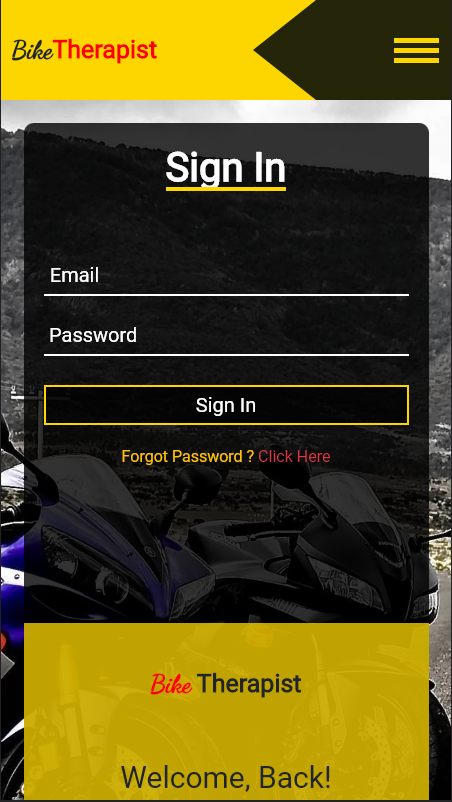
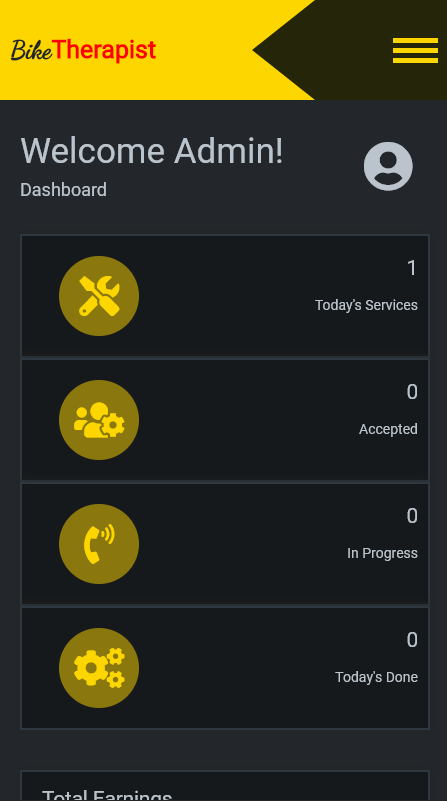
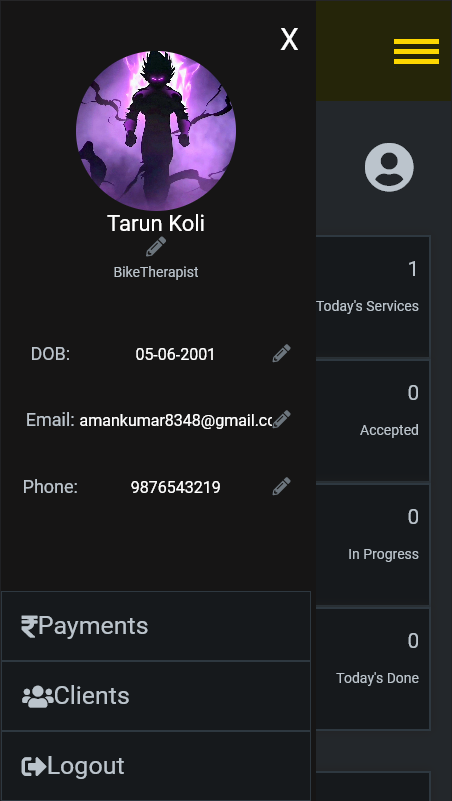

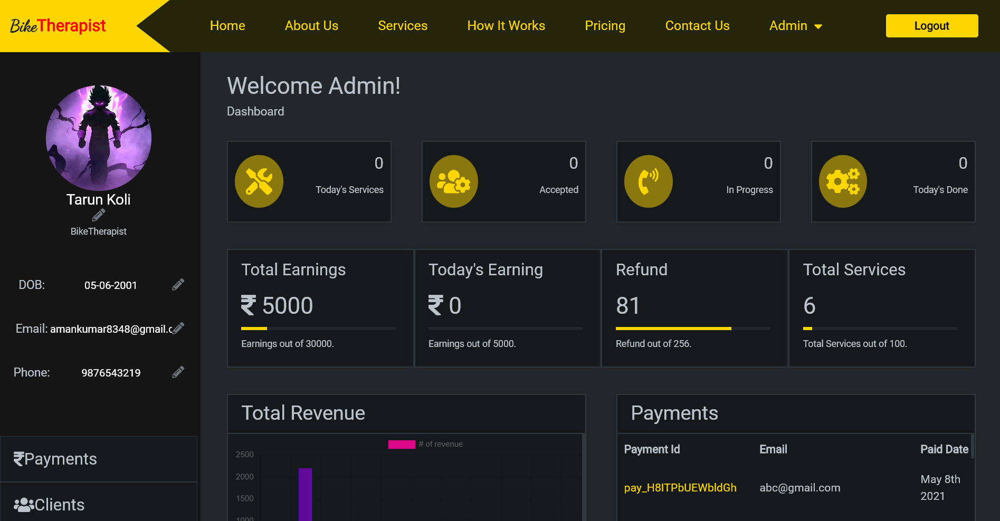

## **Booking Process**

### 1. **User Side**

- Select a variant of the product from the dropdown list. 
  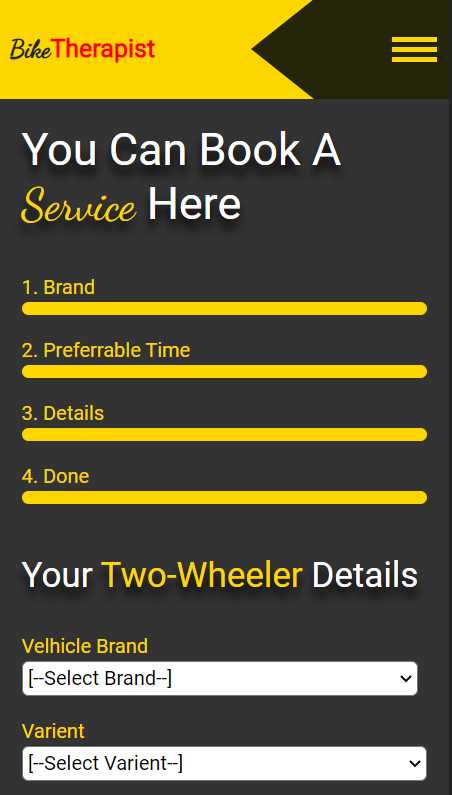
- Select a date & time slot for product service. 
  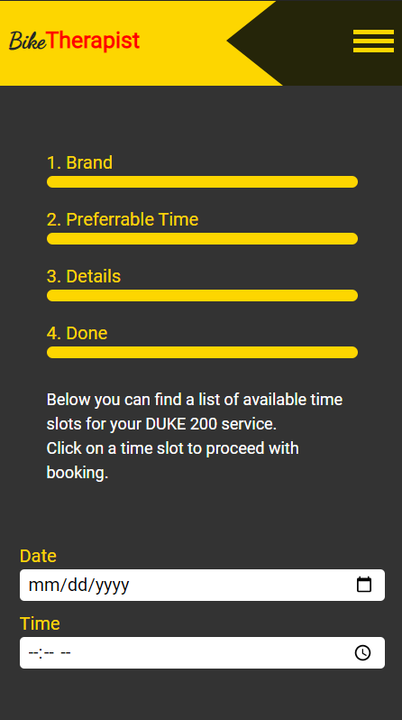
- Add your details to keep the product secure and fo customer support. 
  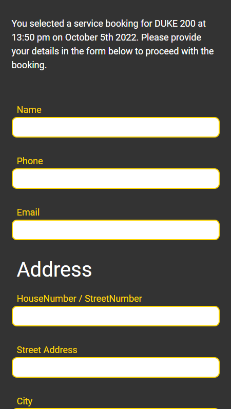
- Payment according to type of variant and number of services. 
  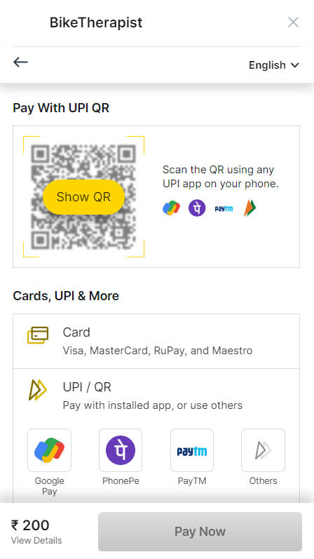
- Get an invoice for your product service (automatically download as soon as transaction is completed).
  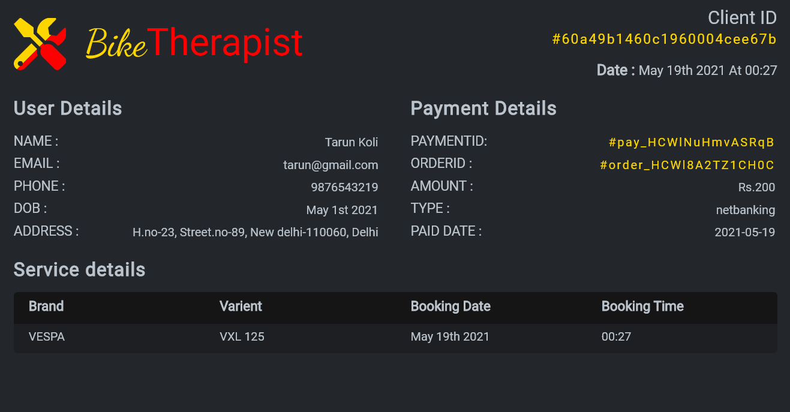

### 2. **Admin Side**

- Dashboard booking section will be populated with all the bookings for today and other important details. 
- Update the user status to let them know about thier booking status. 
  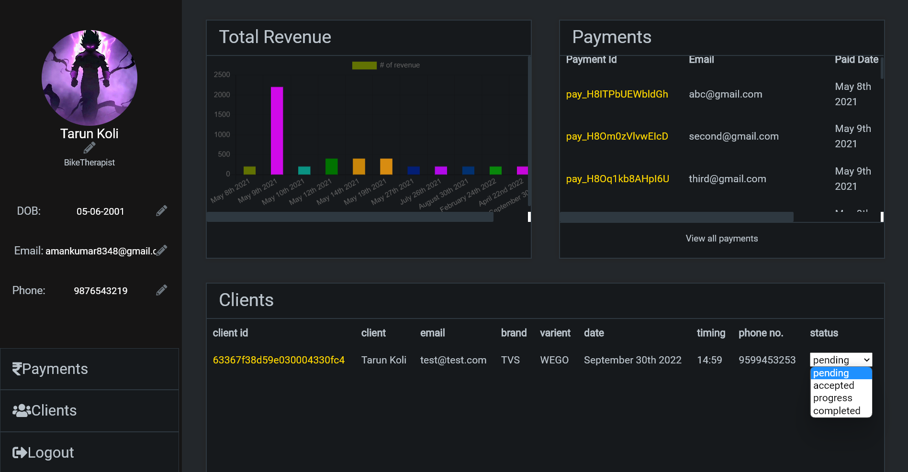
- Goto Payment page to retrieve invoices of customers and handling payments & provide cutomer support. 
  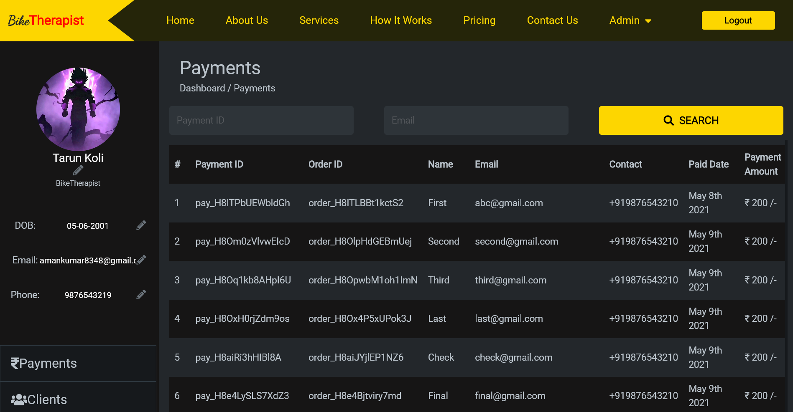

- Goto client page to retrieve the details of every client. 
  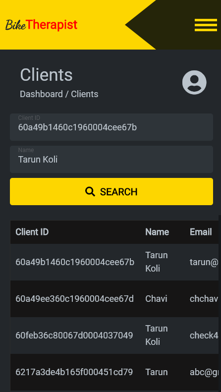

> **Note** : To explore more pages and experience better UI interaction & animations visit bikeTherapist.
